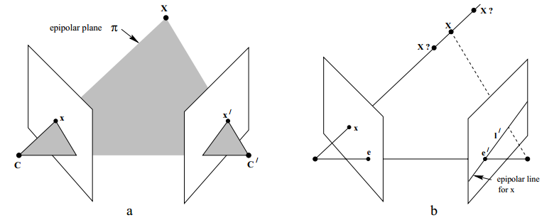
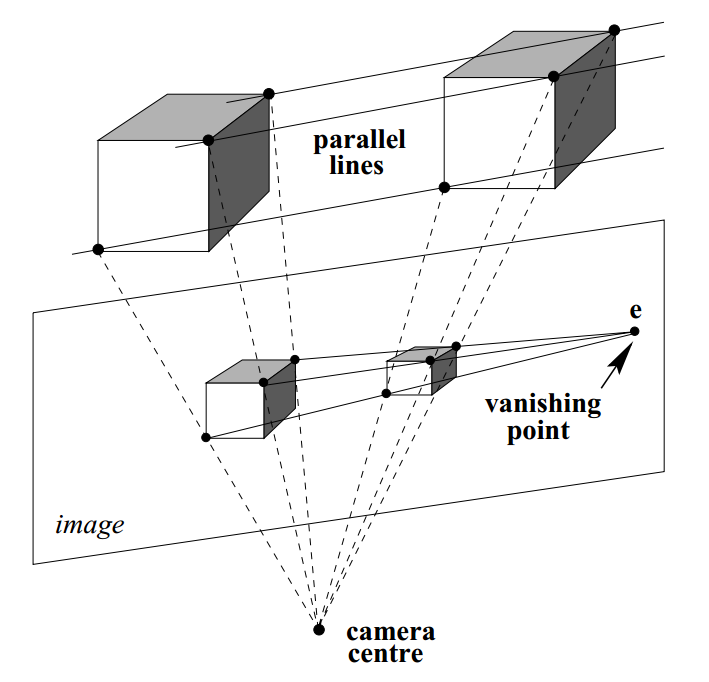
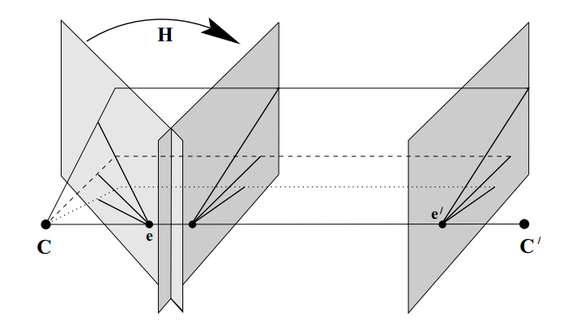
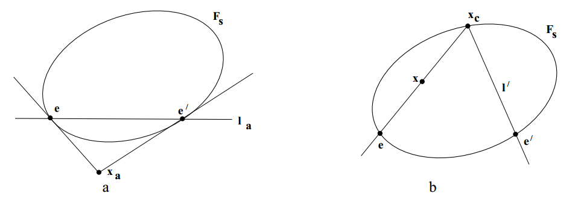
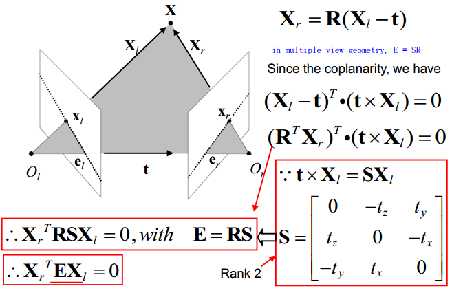

## 极线几何

极线几何是两幅视图之间内在的射影几何，它独立于景物结构，刻画了两个摄像机之间的内在参数和外在参数。

在图中涉及几个关键名词：基线(baseline)、极点(epipolar)\\(e\\)和\\(e'\\)，极平面(epipolar plane)、极线(epipolar line)。

两视图几何的本质是在左右两个视图中寻找点与线的一个对应关系，即映射关系，\\(x\\)代表左视图的一个点，\\(l'​\\)代表右视图的一条直线。
\\[
x \leftrightarrow l'
\\]

### 基本矩阵

这个关系可以用基本矩阵来描述，换句话说，基本矩阵是极线几何的代数描述。基本矩阵有两种推导方式，几何推导和代数推导。

### 几何推导

考虑空间中不通过两个相机的平面\\(\pi\\) ，过第一个摄像机中心和x的的射线与平面\\(\pi\\)交于一点\\(X\\)，这个点再投影到第二个摄像机平面上，这个过程称为通过平面\\(\pi\\)的转移。这个过程可以用公式(2)描述，\\([e']_xH_\pi​\\)定义为基本矩阵F。
\\[
l'=[e']_xH_\pi x=Fx
\\]

### 代数推导

我们也可以用代数方法由两个摄像机的射影矩阵\\(P\\)、\\(P'\\)来推导基本矩阵的形式。从\\(x\\)反向投影的射线可以用式(3)表示，其中\\(PP^+=0\\)，\\(C\\)为摄像机中心，即\\(P\\)的零矢量。
\\[
X(\lambda)=P^+x+\lambda C
\\]

射线上\\(P^+x\\)和\\(C\\)两点分别对应着\\(\lambda=0\\)和\\(\lambda=\infty\\)，注意到\\(C\\)是齐次坐标表示。这样在右视图上的线\\(l'\\)可以表示为\\(l'=(P'C)\times(P'P^+x)\\)，其中\\(P'C\\)是右视图的极点，记为\\(e'\\)。因此基本矩阵可以表示为：
\\[
F=[e']P'P^+
\\]

考虑一个已经标定过的双目相机，将第一个摄像机的相机坐标系设置为世界坐标系，其中\\(P=K[I|0]\\)，\\(P'=K'[R|t]\\)。因此我们可以得到\\(P^+= \begin{bmatrix}K^{-1} \\\\ 0^T\end{bmatrix} \\)，\\(C =\begin{bmatrix} 0 \\\\ 1\end{bmatrix}\\)。

定义极点的表达式为：
\\[
e=P\begin{bmatrix}
-R^Tt \\\\\\
1
\end{bmatrix} 
\quad \quad
e'=P'\begin{bmatrix}
0 \\\\\\
1
\end{bmatrix}
\\]

因此
\\[
\begin{align}
F&=[e']_{\times}K'RK^{-1}\\\\\\
&=K'^{-T}[t]_{\times}RK^{-1}\\\\\\ 
&=K'^{-T}[t]_{\times}RK^{-1}\\\\\\
&=K'^{-T}RK^T[e]_{\times}
\end{align}
\\]
注意：这个基本矩阵的表达式的推导需要用到反对称矩阵的一些性质。

### 对应条件

**结论：对两幅图像中任何一对对应点\\(x\leftrightarrow x'\\)，基本矩阵都满足：**
\\[
x'^TFx = 0
\\]
这个结论很好证明，\\(x'​\\)在对应于点\\(x​\\)的极线\\(l'=Fx​\\)上，因此有\\(x'^Tl'=0​\\)。这个结论的重要性在于，给出了用两幅图像的对应点来刻画基本矩阵的方式。

### 基本矩阵性质总结

* F 是一个7个自由度的秩2矩阵
* 点对应关系 \\(x'^TFx = 0​\\)
* 点线对应 \\(l'=Fx\\) 和 \\(l = F^T x\\)
* 极点 \\(Fe=0\\) 和\\(F^Te'=0\\)
* \\(F=[e']_xP'P^+​\\) ，其中\\(PC=0​\\) 以及\\(e'=P'C​\\)

## 由特殊运动产生的基本矩阵

考虑一个简单例子，假设摄像机的运动是没有旋转并且内参不变的纯平移，不妨设两个摄像机矩阵分别是\\(P=K[I|0]​\\)和\\(P'=K[I|t]​\\)，那么可以得到基本矩阵\\(F=[e']_{\times}KK^{-1}​\\)。如果摄像机平行于x轴平移，则\\(e=(1,0,0)^T​\\)，\\(F=\begin{bmatrix} 0 & 0 & 0 \\\\ 0 & 0 & -1 \\\\ 0 & 1 & 0 \end{bmatrix}​\\)。这时两视图对应点的关系简化为\\(y=y'​\\)，这正是图像矫正所要寻求的关系。

实际上，如果图像点为\\(x=(x,y,1)^T​\\)，由\\(x=PX=K[I|0]X​\\)可以得到空间点的非齐次坐标是\\((X,Y,Z)^T=ZK^{-1}X​\\)。那么我们可以由\\(x'=P'X=K[I|0]X​\\)可以得到从图像点\\(x​\\)到图像点\\(x'​\\)的映射是：
\\[
x'=x+Kt/Z
\\]

再考虑一个更一般的例子，假设两个摄像矩阵是\\(P=K[I|0]\\)和\\(P'=K[R|t]\\)，如图所示，两个摄像机的运动关系可以通过平移+旋转来描述。设图像点为\\(x=(x,y,1)^T\\)，由\\(x=PX=K[I|0]X\\)可以得到空间点的非齐次坐标是\\((X,Y,Z)^T=ZK^{-1}X\\)。由\\(x'=P'X=K'[R|0]X\\)可以的到从图像点\\(x\\)到图像点\\(x'​\\)的映射是：
\\[
x'=K'RK^{-1}x+K't/Z
\\]
这个映射分为两部分，前一部分只依赖于图像位置\\(x\\)，而于点的深度\\(Z\\)无关，而后一部分只依赖于深度，与图像位置无关。容易看出公式(8)是公式(9)的特殊情况，当\\(R=I\\)，\\(K'=K\\)时。

## 基本矩阵的几何表示

任何矩阵都可以分解成一个对称矩阵+一个反对称矩阵，为了研究基本矩阵的几何意义，我们将基本矩阵分解为：
\\[
F=F_s+F_a
\\]

\\[
F_s=(F+F^T)/2 \quad \quad F_a=(F-F^T)/2
\\]

对于\\(x^TFx=0\\)，反对称矩阵\\(x^TF_ax=0\\)，因此只有对称部分起作用，即\\(x^TF_sx=0\\)。矩阵\\(F_s\\)是对称的，在平面上可以表示一条二次曲线；并且可以验证\\(e\\)和\\(e'\\)两点在二次曲线上，由\\(e^TFe=0 \\)以及\\( e^TF_se=0\\)可以得到\\(e^TF_ae=0\\)。矩阵\\(F_a\\)是反对称的，可以记为\\(F_a=[x_a]_{\times}\\)。二次曲线\\(F_s\\)，点\\(x_a\\)以及两个极点\\(e\\)和\\(e'\\)的几何意义可以由上图(a)说明；对于左视图上一点\\(x\\)，连接极点\\(e\\)和点\\(x\\)，得到点\\(x_c\\)，再连接点\\(x_c\\)和极点\\(e'\\)，可以得到右视图上点\\(x\\)的对应线\\(l'\\)。

## 恢复摄像机矩阵

基本矩阵的一个最重要的性质是可以用来确定两视图的摄像机矩阵\\(P​\\)和\\(P'​\\)。基本矩阵包含了摄像机矩阵\\(P​\\)和\\(P'​\\)的信息，但是\\(P​\\)和\\(P'​\\)包含\\(5+5+6=16​\\)个未知量，仅仅由F矩阵是不能恢复出\\(P​\\)和\\(P​\\)的。

但是对于实际工程应用，我们只需要知道两幅视图中点与点的对应关系，并不关系摄像机矩阵\\(P\\)和\\(P'\\)具体的数值。

这里我们不予证明地给出一些数学上的结论：

**结论：**如果\\(H\\)表示3维射影变换的一个\\(4 \times 4\\)矩阵，那么对于与摄像机矩阵\\((P, P')\\)和\\((PH, P'H)\\)的基本矩阵是相同的。

**结论：**对于于摄像机矩阵\\(P=[I|0]\\)和\\(P'=[M|m]\\)的基本矩阵为\\([m]_{\times}M\\)。

**结论：**令\\(F\\)为基本矩阵而\\((P, P')\\)和\\((\tilde{P}, \tilde{P'})\\)都是与基本矩阵对于的两组摄像机矩阵，则存在一个非奇异的\\(4 \times 4\\)矩阵\\(H\\)使得\\(\tilde{P'}=\tilde{P}H\\)和\\(P'=PH\\)。

**结论：**一个非零矩阵\\(F\\)是对应于一对摄像机矩阵\\(P\\)和\\(P'\\)的基本矩阵的从要条件是\\(P'FP\\)是反对称矩阵。

**结论：**令\\(F\\)是基本矩阵，\\(S\\)是任意反对称矩阵，可以定义摄像机矩阵对为\\(P=[I|0]\\)和\\(P'=[SF|e']\\)。

**结论：**基本矩阵的摄像机矩阵可以选择为\\(P=[I|0]\\)和\\(P'=[[e']F|e']\\)。

**结论：**对应于基本矩阵\\(F\\)，一对规范形式的摄像机矩阵的一般公式是\\(P=[I|0]\\)和\\(P'=[[e']_{\times}F+e'v^T|\lambda e']\\)，其中\\(v\\)是任何3维矢量，\\(\lambda\\)是一个正标量。

## 本质矩阵

### 本质矩阵的定义

本质矩阵归一化图像坐标下的基本矩阵的特殊形式，历史上本质矩阵的引入比基本矩阵还早。基本矩阵可以看作本质矩阵的推广，基本矩阵把要求标定摄像机这样一个（非本质）的假设去掉了。

首先介绍归一化坐标，如果已知内参矩阵\\(K\\)，用它的逆矩阵作用于点\\(x\\)得到点\\(\hat{x}=K^{-1}x\\)，这个点\\(\hat{x}​\\)就是图像上的点在归一化坐标下的表示。

用归一化图像坐标表示对应点\\(x\leftrightarrow x'​\\)时，本质矩阵定义为：
\\[
\hat{x}^{'T}E\hat{x}=0
\\]
将\\(x\\)与\\(x'\\)的归一化坐标带入本质矩阵的定义方程可以得到本质矩阵与基本矩阵的关系式：
\\[
E=K'^TFK
\\]

考虑一对归一化的摄像机矩阵\\(P=[I|0]​\\)和\\(P=[R|t]​\\)，本质矩阵有下列形式：
\\[
E=[t]_xR=R[R^Tt]_x
\\]

### 本质矩阵的性质

从\\(E=[t]_xR\\)可以看出，本质矩阵由旋转矩阵\\(R\\)和平移向量\\(t\\)决定，\\(R\\)与\\(t​\\)分别有3个自由度，由于齐次性本质矩阵由5个自由度。

**结论：一个\\(3\times 3\\)的矩阵是本质矩阵的充要条件是它的奇异值中有两个相等而第三个是0。**

### 由本质矩阵恢复摄像机矩阵

本质矩阵可以由对应的归一化坐标直接计算，也可以由基本矩阵计算。一旦本质矩阵已知，摄像机矩阵便可以由\\(E\\)得到恢复。与基本矩阵具有射影多义性不同，在相差一个尺度因子和一个4重多义性下，可以从本质矩阵恢复摄像机矩阵。

### 本质矩阵和基本矩阵的另一种推导

上文首先通过两幅视图上点与线的对应关系得出基本矩阵\\(F\\)，然后又在在归一化坐标系下定义了本质矩阵\\(E\\)，接着又给出了本质矩阵\\(E\\) 与基本矩阵\\(F\\)的关系。

这里给出本质矩阵\\(E\\)的另一种直观的几何推导过程，首先定义本质矩阵\\(E\\)，再利用空间点与图像点的关系定义基本矩阵\\(F​\\)。

这里公式的规范写法为：
\\[
X^r={_l^r}RX^l+{_l^r}t
\\]

